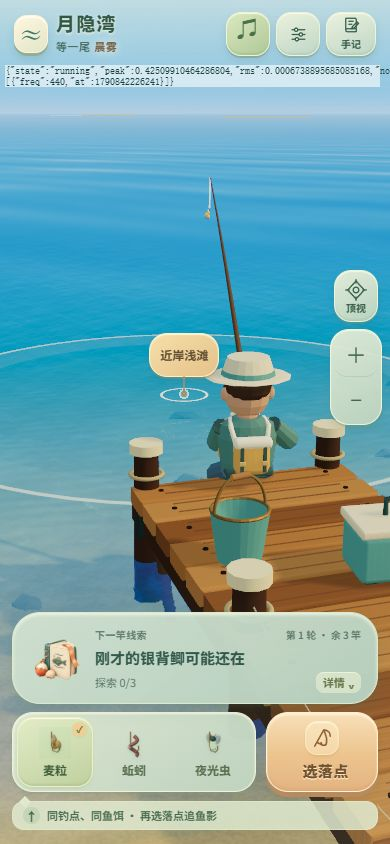

# 声音按钮与全局音频回归修复

## 原因及责任范围

第三版恢复改动引入回归：应用启动时调用 `ensureAudio()`，新页面还没有用户手势，浏览器让 `resume()` 请求一直挂起。第三版又让后续 `ensureAudio()` 复用这份旧 Promise。用户点击声音按钮后仍等旧请求，没有在点击当下再次调用 `resume()`；按钮文案不更新，音效与环境声都无法开始。

独立诊断页是在手势中直接初始化音频；第三版正式游戏检查用的验证源又保存过“关”偏好，开场请求被跳过。两条路径都绕过了有缺陷的冷启动。本轮在新验证源的正式游戏页复现：点击后上下文一直 suspended、输出峰值为零、声音按钮没有变化。不能将第三版的录音验证当作按钮正常的证据。

## 修正

- 应用启动移除 `ensureAudio()`，直到首次触控/声音按钮操作才创建和恢复音频。
- 上下文未运行时，每次新的 `ensureAudio()` 立即发出新的 `resume()`；不复用被浏览器挂起的开场请求。旧请求完成只能清理自己的引用。
- 结果声音等待当前恢复请求时，不另造一份恢复请求；保留 250 毫秒过期丢弃与静音/后台取消规则。
- 保留既有结果分类、旋律、音源截取位置与静音偏好，不修改钓鱼逻辑和存档。

## 测试

新增回归测试先在旧代码失败（点击后恢复调用次数仍为 1），修复后通过：

1. 旧自动播放请求永不结束，新点击仍须立即恢复；接着关闭/开启成功。
2. 执行实际应用的启动片段，确认开场没有任何音频启动请求。

原音频测试继续覆盖中断恢复、失败重试、静音优先、背景取消、恢复超时与结果去重。完整 `npm test` 481 项通过，`npm run build` 和资源校验通过，`git diff --check` 通过。

## 正式按钮验证

独立本地端口的正式应用与场景，使用浏览器真实点击，390×844 手机画幅再次检查刷新路径。输出探针接在正式主输出图，不改变 `AudioContext` 的恢复行为。

| 操作 | 实际结果 |
| --- | --- |
| 修复后首次点击声音按钮 | 声 · 开，running，实际输出峰值约 0.1374，两音确认声开始 |
| 点击关闭 | 声 · 关，suspended |
| 点击重新开启 | 声 · 开，running，新确认声节点开始，输出恢复 |
| 保存开启偏好后刷新，再首次点击 | 开场不创建上下文；点击后 running，实际峰值约 0.0836 |
| 关闭后刷新，换饵 | 保持声 · 关，未创建音频上下文 |
| 再点声音按钮 | 声 · 开，running，实际峰值约 0.1404 |
| 开启后正式抛竿/入水 | running，实际峰值达 0.4783；正式抛投音开始；无音频或资源错误 |

暂停后分析器可能保留旧采样，不把该缓存当作仍在出声。更详细的操作读数见 `button-checks.json`；画面见下。

## 一致性及限制

第四版规格、正式启动代码、恢复实现、测试和完成清单一致。没有新增运行时音源、渲染节点或诊断界面；诊断入口、服务器和浏览器页在验证后清理。未处理用户当前页面和存档。

本轮复现并修复了明确的浏览器启动死锁，正式按钮和输出图复核通过。真机扬声器听感、微信内嵌浏览器及低端性能尚未逐机复核。第三版的问题已定位到本轮改动，不再以用户页面地址未知解释该回归。
