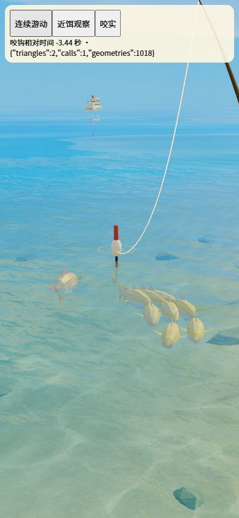
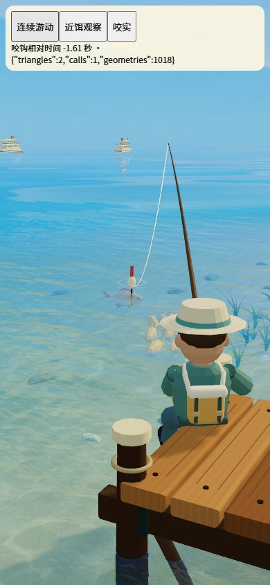
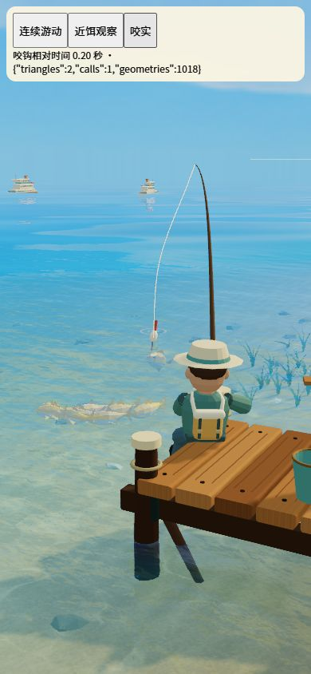
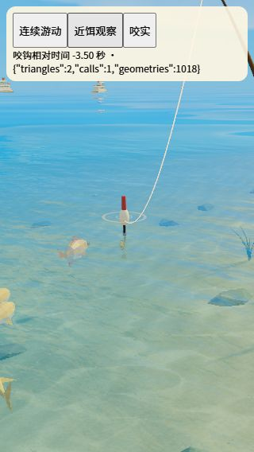

# 近饵自主游动验证

## 变更与一致性

- 规格：`docs/design/fight-simulation-spec.md` 的“近饵游动与徘徊”。
- 路径：5.5 至 4.3 秒前沿三次曲线接近，4.3 至 1.1 秒前绕饵并两次探近/退开，最后 1.1 秒沿三次曲线咬钩；咬钩时间未改变。
- 朝向取水平路径切向，沿用有限角速度转头；温和尾摆与小幅身体摆动表达自主游动，末段衔接原咬钩姿态。静态饵深与基础接近高度轨迹保留，鱼体不随浮漂点动升降。
- 不新增网格、材质、粒子或 draw call。每帧用两个纯函数位置样本求切向，无额外物理求解；非鱼仍被现有场景条件排除。
- 文档、纯函数、场景接线与测试核对一致。

## 自动验证

- `node --test tests/bait-engagement.test.mjs tests/fight-fish-motion.test.mjs`：21 项通过。
- `npm test`：409 项通过，含三信号探近/退开、朝向与位移一致、路径转弯速度、连接连续性、无效输入、尾摆与咬钩衔接，以及原浮漂深度隔离测试。
- `npm run build`：构建与资源校验通过。

## 浏览器抽查

- 使用真实 `createWorld`、正式旧金鱼 GLB 与独立临时状态，不读写玩家存档。预加载后连续播放接近到咬钩。
- 390×844：绕饵与后续试探处能辨认鱼体位置、朝向的变化；末段靠近钩点并进入咬实姿态。320×568：近饵鱼影和浮漂保留在画幅。临时入口已移除。
- 截图属于阶段抽查，不能证明整段每一帧的口缘像素贴合、全部鱼种效果或真实触屏手感；路径连续、切向和接触收敛由测试补充约束。

## 未验证项与设备验证方式

- 低端 Android 手机以 9:16 持续抛竿观察，录制靠近、徘徊、轻提鱼饵及咬钩衔接；分别查看宽游、急点与深沉信号，以及不同体型。
- 对比修改前后相同设备、场景和画质的帧率/帧时间及内存；检查转弯时无倒游、卡顿、上钩前高速挣扎，鱼影与浮漂同框且可读。浏览器截图不替代该项实机验收。
