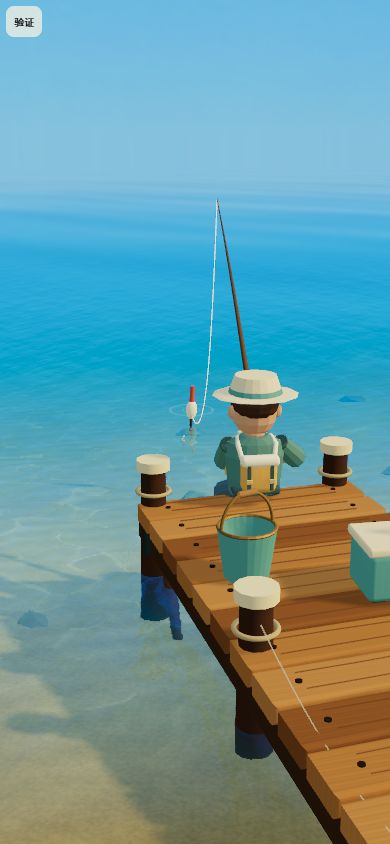
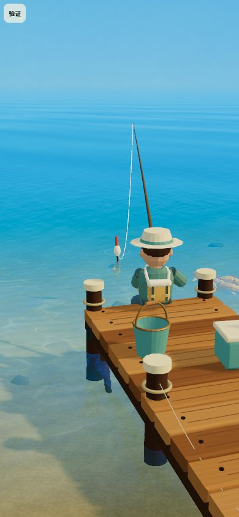
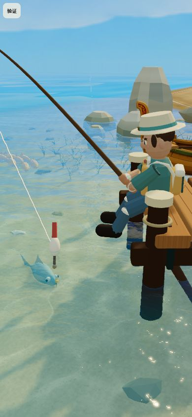
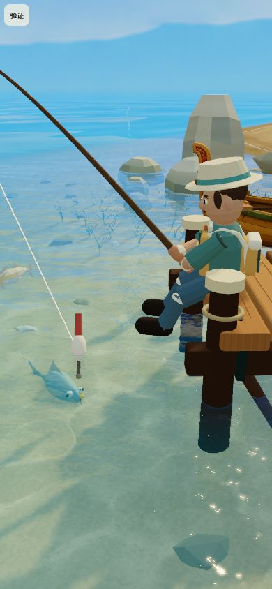

# 清亮空气与远水减雾验证

版本：`2026.10-air-light`，日期：2026-10-01。

## 问题与结果

天空第二版已消除白色贴图亮带，但主水面的雾从 24 米开始，到 118 米附近已接近全覆盖，并伴随较强去饱和，造成较宽的蓝青雾墙。用户继续反馈雾偏浓。本轮让中远水保留波纹、倒影和颜色层次，雾量随距离缓慢增长，仅在极远处收向天空。

- 共享天空散射峰值从 0.32 降至 0.16，垂直范围缩窄；天空和反射仍使用同一函数。
- 水面改用连续指数雾 `1-exp(-d²×0.00000625)`，上限 0.985。100/200/400/800 米约为 6%/22%/63%/98%；不再由细波法线影响雾量，不在百米附近提前覆盖海面。去饱和权重由雾量的 42% 降至 14%。
- 场景普通天气雾密度为 0.00125，初始化与天气切换共用函数；雾天对象雾密度保留 0.0028。水面指数雾是独立海天衔接近似，并非新增天气模型。
- 六张天空 PNG、资源哈希、天空选择/旋转、光照/曝光、水体吸收和反射权重未因本轮修改；没有增加采样、纹理、网格、draw call 或 render target。

## 视觉对照

390×844 竖屏为主。独立场景夹具使用发布默认画面参数、天空 02 / 82°，水波固定时间 8；其他次级动画仍运行，不能把整张图当作逐像素等价实验。减雾前后保持同一纹理、光照与相机，切换只替换散射/水面空气透视和场景雾参数。原始参数保存在 `baseline.json`。

| 镜头 | 减雾前 | 减雾后 |
| --- | --- | --- |
| 晴天等待 |  |  |
| 晴天搏鱼 |  |  |

- 中远水的波纹与色彩层次比原来清楚，地平线仍连续衔接，没有在本次镜头中露出有限水面边界或硬切。近水吸收与沙底没有随雾控制重新铺色。
- 六张天空切换：`sky-01.jpg` 至 `sky-06.jpg`，加载和渲染正常。
- 雨后等待/搏鱼：`rain-wait.jpg`、`rain-fight.jpg`；雾天等待：`mist-wait.jpg`。雾天保留既有较浓场景对象雾；本轮没有宣称完整的天空/海水天气散射模型。
- 320×568：`small-320.jpg`；844×390 横屏兼容：`landscape-844.jpg`。水面/天空继续渲染，未在这些视角观察到边界穿帮。没有检查任意高度、任意天顶/天底方向。
- 浏览器 error/warn 日志为空。夹具不导入游戏 UI，不写存档/画面偏好；没有完成完整抛竿/上岸操作录像或真机触控验收。

复验入口由 `node tools/create-fog-preview.mjs` 生成，启动本地开发服务后打开 `/__fog-preview.html`。六个天空、前后雾化、天气和镜头均有触控按钮。临时 HTML、测试服务和浏览器标签页已清理，不进入发布构建。此前天空贴图对照工具也恢复原版的旧雾表达，以免后续减雾影响历史对照的复现。

## 自动测试与一致性

- 新增 3 项：直接执行实际 GLSL 距离雾函数，覆盖零/负/近/远/极远输入、连续/单调/有界；检查主水面使用该函数且没有旧角度门槛/早期全覆盖；检查普通/雨/雾/未知天气密度，以及初始化与天气切换使用同一接口。
- 加强现有共享天空公式测试，检查 0.16 上限和远离赤道后的影响范围；六张 PNG 的尺寸、接缝、极点、赤道、下半球与哈希回归继续通过。
- 相关 47 项通过，见 `related-tests.log`；全量 `npm test` 432 项通过，见 `tests.log`；`npm run build` 与资源校验通过，见 `build.log`。
- 六张发布资源与 `assets_pipeline/sky/v2/manifest.json` 和构建文件一致；未重新生成贴图。规格、公式、数值测试与本轮清单对应，历史报告中的参数保留为当时版本记录。
- 本轮文件范围的 `git diff --check` 通过。工作区全量默认检查将其他改动中 `src/app-final.js` 的 CRLF 行尾报告为空白；采用 `git -c core.whitespace=cr-at-eol diff --check` 后通过。本轮没有修改该文件或替其他改动重排行尾。

## 未验证项

低端手机 GPU 帧时间、峰值内存、长时间环绕与完整垂钓录像未实测。真机按 9:16、默认画面参数分别在晴天/雨后/雾天环绕和垂钓各 60 秒，检查远水是否露边、横向波纹是否稳定、天空/倒影是否同步，记录帧时间与异常日志；沿用当前天空贴图与局部反射设置进行修改前后对照。本轮只调整公式和常量，不能用桌面截图替代低端性能验收。
