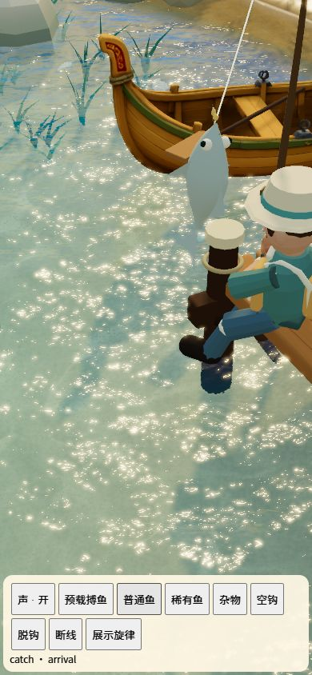
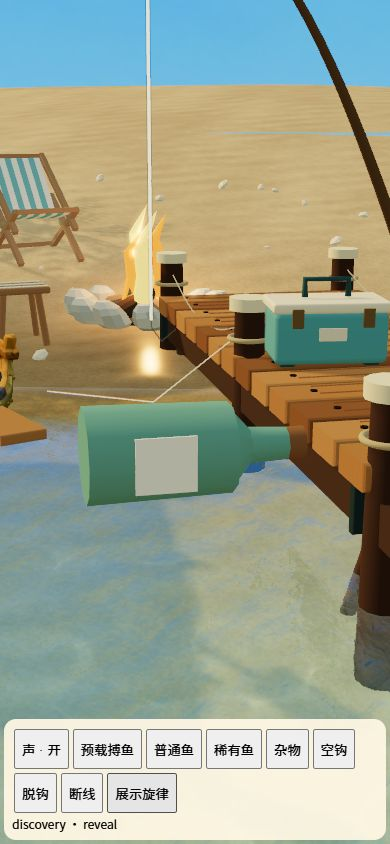
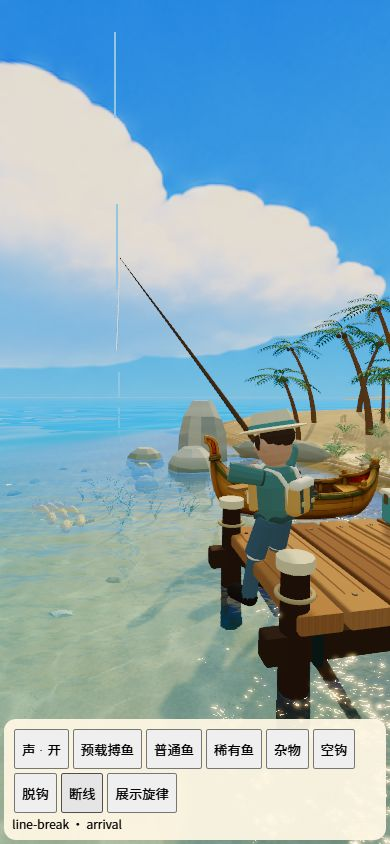
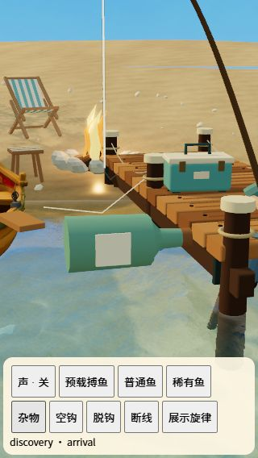
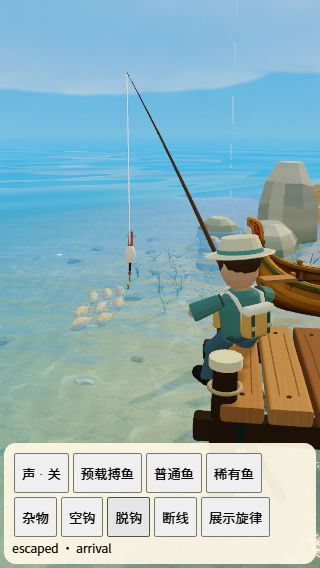

# 不同结果的运镜、音效与情绪反馈验证

## 实现与规格核对

规格：`docs/design/outcome-feedback-spec.md`。

- 从真实钓获身份和失鱼原因分类，优先级与现有结果标题一致：非鱼、追踪重逢、特殊、首次、纪录、普通；无钓获再区分断线、脱钩、错过鱼口、空钩。
- 结果到达与展示各一段。上岸到达只补轻落定，实际提鱼水声继续由场景的提鱼帧触发；展示播放相应短旋律。失败只在事件发生时播一次，收回空线完成后不叠第二段失败音。
- 普通偏温暖，首次偏明亮，纪录含低音分量，特殊含通透高音，重逢为暖旋律；杂物采用轻碰与两音问句。断线短断裂/风声、环境混音短暂让位，脱钩为水声和下行，空钩平静收回。
- 镜头在原有上岸/物理回弹基础上连续叠加小幅推退、侧移、抬升与视角变化。杂物也进入实体跟随镜头，稍偏侧、略宽；断线新增情绪运动从 0.4 秒后开始，保留原回弹首段。减少动态效果关闭新增镜头运动。
- 每竿每阶段去重；静音恢复和后台事件消耗后不补播。关闭声音或切后台会取消已经调度的结果音源，HTML 音频回退的延迟片段也取消；环境混音复位。
- 无新增模型、渲染通道、音频资源或解码负担。每段最多 4 个声音条目，铃音每音 3 个振荡器；新阶段会清理前阶段尾音，避免结果节点持续累积。
- 无抽鱼、鱼距、奖励、存档或演出时长调整；源码、测试与新规格一致。

## 自动检查

- `tests/outcome-feedback.test.mjs`：6 项，覆盖分类优先级/无副作用、10 种音画差异、资源存在、镜头连续与幅度边界、断线首段避让、阶段去重、安静恢复和后台事件。
- `tests/outcome-audio.test.mjs`：2 项，执行实际 `createAudioSystem`，以音频节点替身验证调度、静音、后台取消、复位，以及 HTML 回退延迟不补播。该测试验证调度逻辑，不能替代真实扬声器听感。
- `tests/result-dialog.test.mjs`：现有结果流程回归，增加真实结果事件接线；恢复的结果消耗为安静事件，重复上岸不重复发音。
- 完整 `npm test`：434 项通过。
- `npm run build` 与 `git diff --check`：通过。

## 浏览器抽查与证据

使用真实 `createWorld`、`createAudioSystem` 和独立临时状态，未写入玩家存档或声音偏好。验证控件位于底部，不属于产品 UI；临时入口已移除，浏览器尺寸恢复。

- 390×844：普通上岸、杂物跟随、断线首段分别触发，场景鱼/瓶子与相关竿线可见。
- 320×568：杂物在画幅内单独展示；脱钩后镜头退出，竿线和人物可见。
- 浏览器通过点按解锁音频，触发结果到达与展示分支，检查期间未记录音频、资源或渲染异常。截图不能证明声音内容或毫秒同步，未宣称完成主观听感验收。
- 图中活鱼使用运行时鱼体；本次不证明所有正式鱼种资产在结果镜头中的完整覆盖，也不证明实际完整游戏操作与结果窗遮挡的全程体验。

## 未验证项

1. 真实 iOS/Android 的扬声器与耳机听感、分量及环境混音层次，重点比较断线/脱钩和普通/稀有/杂物；录制结果事件核对音效、原物理振动与运镜的时序。
2. 手机中途静音、切后台再回来、重复更新与恢复存档，检查不补播旧声音、不重复振动。
3. 低端移动设备在相同画质下对比帧时间、内存和声音节点情况；完整操作覆盖不同钓点、鱼种、重量和结果窗，确认鱼体/杂物不被人物或 UI 遮挡。
