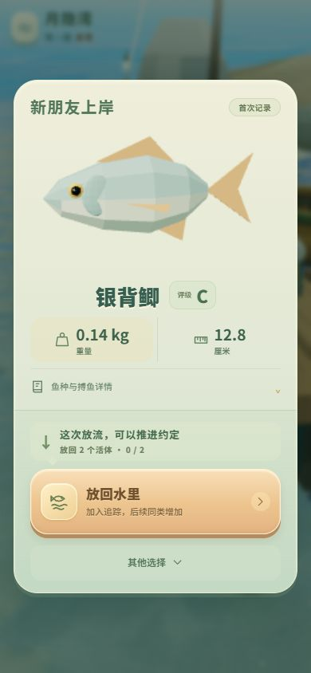

# 结果反馈可感知性修正

玩家反馈“好像没有”。第一版有事件接线，但身份旋律只在结果窗打开时播放，镜头推移及声音强度偏小，不能据此宣称上岸过程已有明显情绪区分。

## 修正

- 正式场景在上岸演出满 1.05 秒、钩点高于 0.55 米时发送展示事件；实际应用消费现有去重器的 `reveal`，提前播放身份旋律并开始展示镜头。结果窗开启不重复播放；恢复的已结算状态被排除，保留未达到条件时结果窗的兜底。
- 镜头类别差异增强：约 0.16–0.60 米推近、最高 0.50 米侧移、最多 4.5 度视角变化；失败退镜仍从零平滑进入，断线首 0.4 秒保留物理回弹。推退依据相机到取景目标的视线，而不是抛竿方向。
- 展示旋律普通类别每音 0.065、特殊 0.08、杂物 0.05；失败实体声与扫频增强，环境声短时让位。声音开关偏好未改变。

## 验证

- 新回归覆盖上岸展示资格边界、正式场景回调和应用接线、“到达→上岸展示→结果窗”去重，及可感知的旋律强度和特殊镜头幅度。
- `npm test`：443 项通过；构建/资源校验、`git diff --check` 通过。
- 独立验证端口的真实游戏页面，以 WebMCP 正常抛竿和真实控件拖动完成一条 0.14 千克银背鲫的搏鱼、上岸及首次结果窗；390×844 截图见下。控制台未记录音频、资源或渲染异常。
- 前几竿因检查跨调用错过窗口，实际完成了鱼口超时到回归准备态；不将这些超时当作断线或搏鱼脱钩的验证。
- 验证页面此前的结果存档只读查看，未处理；正式流程使用另一个独立端口的存档，不改用户当前游戏的存档与声音偏好。临时服务器与浏览器页已关闭。

## 限制

截图证明正式流程可完成，不证明旋律的主观听感或所有镜头每一帧的取景。上岸提前触发和重复音效隔离由回归测试补充。用户实际页面地址/版本尚未提供，不能确认其正在使用的页面已载入本轮构建。手机听感、持续录屏同步、全部结果类别与低端性能仍需实测。
