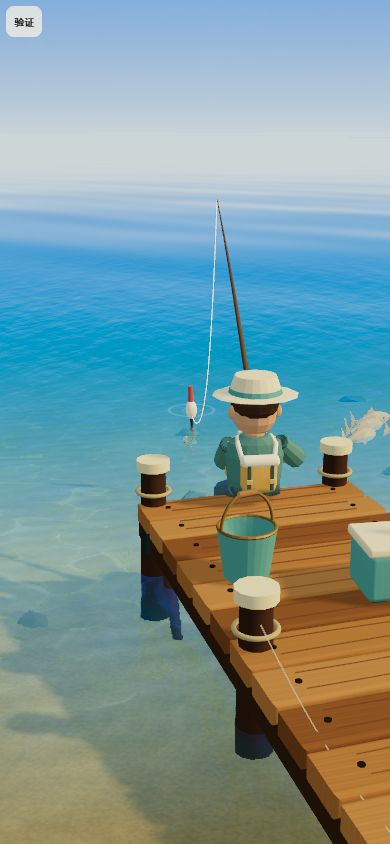
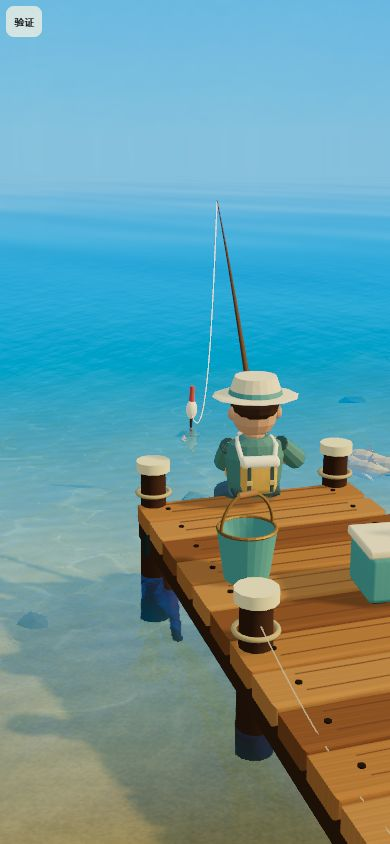
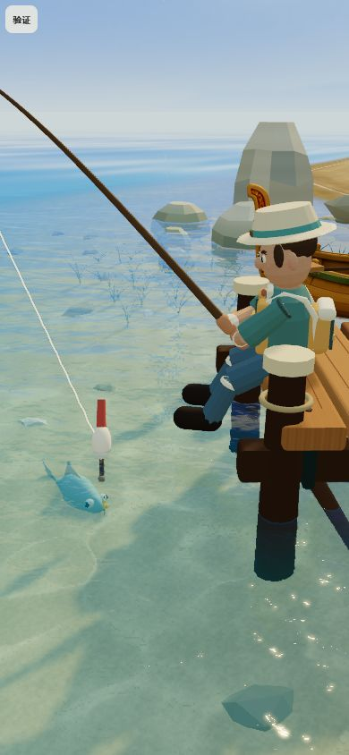
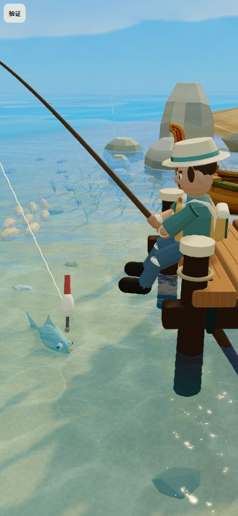

# 天空球与天际线第二版验证

版本：`2026.10-sky-v2`，日期：2026-10-01。

## 结果与修改范围

六张天空贴图已更新，保留原 ID、1774×887 尺寸、欧卡休闲 3D 的圆润奶油云与蓝灰阴影。真正的地平线保留蓝青渐变，不烘焙白色水平亮带或第二个海面。左右经度接缝和极点经过离线规范化。

用户截图中的泛白同时受到运行时雾化影响：旧共享函数把地平线大量混向线性 `(0.54,0.70,0.73)`，主水面又独立使用同一常量。现在共享空气色约为 sRGB `#76b5ce`，赤道散射权重上限由 0.88 降至 0.32，降低去饱和。远水改为沿观察方位采样当前天空地平线，再使用同一散射函数，因此天空选择与旋转也同步影响远水。

曝光、太阳方向、发布默认天空 02 / 82°、画面参数与游戏存档接口未改。本轮额外的水面开销为一次地平线天空采样，不添加网格、render target 或渲染通道。贴图处理工具仅用于离线，不进入浏览器包。

## 资源来源与检查

创作与云层构图修订全部使用内置 `image_gen`，每张独立编辑。原图和旧共享 shader 已备份在 `assets_pipeline/sky/v1/`。最终生成源、构图草稿、完整提示词/修订词、最终 PNG、清单保存在 `assets_pipeline/sky/v2/`。详见 `assets_pipeline/sky/README.md`。

| 天空 | 最终 PNG 字节数 | 赤道平均 RGB（sRGB） | 两端最大色差 | 极点经度差 | 边缘导数最大差 | 赤道邻行最大差 |
| --- | ---: | --- | ---: | ---: | ---: | ---: |
| 01 | 919015 | 67.64 / 167.23 / 250.32 | 0 | 0 | 7 | 3 |
| 02 | 906587 | 74.55 / 178.95 / 253.43 | 0 | 0 | 9 | 3 |
| 03 | 932074 | 91.12 / 187.17 / 214.59 | 0 | 0 | 8 | 3 |
| 04 | 955314 | 126.20 / 200.30 / 226.50 | 0 | 0 | 7 | 3 |
| 05 | 930198 | 93.41 / 204.43 / 235.08 | 0 | 0 | 8 | 3 |
| 06 | 872972 | 117.93 / 203.60 / 237.99 | 0 | 0 | 7 | 2 |

色差单位为 8 位色阶。六张文件总量从 6764296 字节降至 5516160 字节，减少约 18.5%。每张纹理的保守 RGBA + mip 估算仍约 8 MiB；既有控制器按选择加载并缓存，多选后的缓存上限未增加。这是资源预算估算，不是 GPU 实测。

质量门槛覆盖逐像素的赤道渐变和下半球色度，不能仅用整图平均亮度掩盖局部亮带。重建工具先检查全部六张，全部通过后才替换发布资源。`resources.log` 与 `manifest.json` 记录重建结果，发布图、归档最终图和构建图哈希/字节一致。

## 实画检查

使用独立 `createWorld` 夹具，390×844 竖屏为主；水波固定在时间 8，默认画面参数、天空 02 / 82°。角色、鱼群等次级动画仍使用真实时间，不承诺整个截图逐像素一致。晴天与雨后分别检查；临时页面不导入游戏 UI，不写入画面偏好或游戏存档。

旧版对照同时使用备份原图、旧共享散射和旧水面常量雾色；只在验证页面替换，不影响发布代码。

| 同镜头对照 | 旧版 | 新版 |
| --- | --- | --- |
| 等待 / 晴天 / 天空 02 / 82° |  |  |
| 搏鱼 / 晴天 / 天空 02 / 82° |  |  |

- 六张选择的同一等待镜头：`after-01-wait.jpg` 至 `after-06-wait.jpg`。天空与远水分别保持各图的蓝/青气氛，切换没有加载失败或 shader 错误。
- 水面倒影随着天空旋转变化；`rotate-0.jpg`、`rotate-180.jpg`、`rotate-360.jpg`。0° 与 360° 的静态天空构图视觉等价，水平边缘没有明显竖缝；整个截图会因鱼/角色动画有差异。反射方向可包含屏幕外的云，因此部分方位近水会出现较亮的云倒影，这不是天空地平线的白色烘焙条纹。
- 雨后等待与搏鱼：`after-02-rain-wait.jpg`、`after-02-rain-fight.jpg`；海平线仍有蓝青色，云底未形成贯通海平线的白条。
- 320×568：`small-320.jpg`；844×390 仅做横屏兼容：`landscape-844.jpg`。天空、水面持续渲染，没有看到贴图边缘、明显接缝或加载缺块。极点均匀性采用像素检查；未进行天顶/天底全视角实画。
- 补充近景、俯瞰、瞄准、鱼讯、出水切换中的渲染快照：`after-02-close.jpg`、`after-02-top.jpg`、`after-02-aim.jpg`、`after-02-bite.jpg`、`after-02-landing.jpg`。这些是场景状态夹具，不代表实际完整操作录像。
- 验证页面的浏览器 error/warn 日志为空。UI HUD 与真实触屏持续操作没有在本轮夹具内验收。

需要复验时运行 `node tools/create-sky-preview.mjs`，再启动本地开发服务打开 `/__sky-v2-preview.html`。页面提供六个天空、旧/新版、旋转、天气和镜头按钮；构建前应移除生成的临时 HTML 与 `public/assets/__sky-v1/`。本轮已移除它们，旧图不进入发布构建。实画期间使用关闭热更新的临时本地服务，避免其他工作区改动重置镜头；该服务和临时标签页已关闭。

## 自动验证与一致性

- `tests/sky-textures.test.mjs` 新增 7 项：实际 GLSL 标量函数的连续/有界/色度检查，六图尺寸与哈希/赤道/接缝/极点/下半球验证，PNG 往返与异常拒绝，原图不被规范化修改，接缝字节上下溢边界，远水使用当前天空的集成回归，以及质量门槛拒绝白带/硬赤道/接缝/下半球云色。
- 相关天空/水体 44 项通过，见 `related-tests.log`；全量 `npm test` 406 项通过，见 `tests.log`。
- `npm run build` 与资源检查通过，见 `build.log`；构建中的六张天空与发布图完全一致，未包含验证旧图。
- `git diff --check` 通过。源码、规格、提示词来源、像素清单与新条目对应；历史功能的验收声明保持原记录，没有据此补记为真机完成。

## 未验证项与低端手机方式

没有低端 Android / iOS 真机 GPU、峰值内存和长时间切换实测，截图也不能替代连续触控/完整抛竿搏鱼录像。真机需在 9:16 下逐张选择并环绕各 60 秒，检查 0°/360° 接缝、云层倒影、等待/搏鱼海平线、切换瞬时卡顿与纹理缓存峰值；记录 GPU 帧时间、进程内存与异常日志。使用同画面参数对照本轮前/后，并额外对照局部物体反射 0 / 0.65，区分既有反射追踪成本与本轮增加的一次天空采样。
